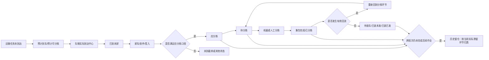

# 中心运营看板—分拣区看板 PRD V1.1

> **文档说明**：本文档依据《产品需求文档（PRD）撰写标准规范 V1.0》整理，并以《分拣区看板—独立版》HTML 原型为需求基线。原型中的票数、袋数、车辆数、时间和组织名称均为演示数据，不作为生产验收的固定结果；验收以本文定义的统计口径、交互规则和数据一致性为准。

***

## 文档头部信息

| 字段       | 内容           |
| -------- | ------------ |
| 需求名称     | 中心运营看板—分拣区看板 |
| PRD 版本号  | v1.1         |
| 原型版本     | V3.09        |
| 状态       | 草稿           |
| 产品负责人    | 待补充          |
| 创建日期     | 2026-07-14   |
| 最后更新日期   | 2026-07-14   |
| 产品内部评审时间 | 待补充          |
| 产品内部评审人  | 待补充          |
| 产品内部参与人  | 待补充          |
| 研发评审时间   | 待补充          |
| 研发评审人    | 待补充          |
| 研发参与人    | 待补充          |

### 交付物清单

| 交付物     | 格式          |  必填  | 说明                              |
| ------- | ----------- | :--: | ------------------------------- |
| PRD 文档  | Markdown    |   ✅  | 本文档，定义业务流程、指标口径、交互、数据规则、权限与验收标准 |
| 原型      | HTML        |   ✅  | `分拣区看板-独立版V3.09.html`           |
| 接口/数据设计 | Spec Design | 研发输出 | 研发评审后补充接口、数据模型、任务拆解和容量评估        |
| 测试用例    | 测试文档        | 测试输出 | 依据本文 UAT 场景、指标字典和边界规则编写         |

### 版本记录

| PRD 版本 | 日期         | 变更人 | 变更内容                              |
| ------ | ---------- | --- | --------------------------------- |
| v1.1   | 2026-07-14 | 待补充 | 补充分拣机状态的展示指标、统计口径、对比周期、交互、边界及验收规则 |
| v1.0   | 2026-07-14 | 待补充 | v3.09                             |

***

# 一、需求概述

## 1.1 需求背景

中心分拣作业涉及运输到达、卸车、入库、分拣、集包、装车及发运等多个连续环节。现场管理人员需要同时关注预计进入量、已到未卸、应分拣、待分拣、已分拣、回流和历史留仓，但现有信息往往分散在不同页面或报表中，口径不统一，难以快速识别班次产能压力、长时间滞留、回流异常及目的流向积压。

本需求在“中心运营看板”中建设分拣区单页看板，以中心、操作日、日期范围和分拣班次为统一筛选条件，集中展示关键指标、小时趋势、设备与人工产量、目的流向、回流原因和历史留仓，并支持从汇总指标逐层下钻到车辆、袋号和运单明细，帮助现场管理人员完成实时监控、异常定位和数据导出。

## 1.2 目标价值 / 影响面

1. **统一现场数据口径**：预计到车、已到未卸、应分拣、待分拣、已分拣、历史留仓和回流率均使用统一的中心、操作日与班次条件，减少跨报表人工对数。
2. **提升异常定位效率**：从 KPI、时长分布、货物来源、分拣维度、目的流向逐级下钻至运单或袋号，目标是将常见积压定位路径由多页面查询缩短为 3 次以内点击。
3. **支持班次产能判断**：通过预计进入分拣量、小时参考能力、班次剩余参考量、当前时速和趋势对比，为现场人员提供可核验的数据依据。
4. **强化长滞留治理**：按 `<24H`、`24-48H`、`48-72H`、`>72H` 展示滞留量，并按当前实际滞留环节归类，便于责任分派。
5. **影响角色**：中心运营负责人、分拣主管、卸车主管、设备运维、现场调度、数据分析人员、区域/总部运营管理人员。
6. **影响范围**：Web 端中心运营看板的分拣区页面，以及其下钻查询、导出、权限和埋点能力；不直接改变 PDA/APP 作业流程。

## 1.3 需求涉及端口

| 端口       | 是否涉及 | 说明                                 |
| -------- | :--: | ---------------------------------- |
| Web PC 端 |   ✅  | 本次核心范围，中心运营后台看板及下钻弹窗               |
| App      |   ❌  | 本期不新增 App 页面；原型中的“移动端（观辰）”仅为界面切换入口 |
| PDA/PAD  |   ❌  | 不改变现场扫描、集包、卸车等作业操作                 |

## 1.4 本期范围

### 1.4.1 范围内

- 分拣区业务导航及页面入口。
- 中心、操作日、日期范围、分拣班次筛选及查询。
- 核心 KPI 和重点关注事项。
- 分拣票数趋势、小时/累计切换、当前时速等运营摘要。
- 分拣机与人工分拣对比、分拣机状态趋势。
- 已分拣目的流向的统计视角、分类、表格/图表和小时/累计切换。
- 回流率指标口径及回流原因分布。
- 历史留仓时间分布和当前滞留环节分布。
- 预计到车、已到未卸、应分拣、待分拣、已分拣、历史留仓下钻。
- 车辆、袋号、运单明细查询、分页、刷新、列设置、全屏和导出。
- 按钮权限、数据权限、操作日志和埋点。

### 1.4.2 范围外

- 新增或修改运输、卸车、分拣、集包、装车等作业流程。
- 现场任务调度、人员排班、设备控制或自动派单。
- 根据差值自动输出“加人”“开线”“停线”等处置结论。
- App/PDA 页面改造。
- 原型中“概况、卸车区、装车区、异常区、运营驾驶舱、移动端”的完整页面建设。

## 1.5 核心成功指标

| 指标        | 目标                      |
| --------- | ----------------------- |
| 首页核心指标一致率 | 与来源系统按同口径复核一致率 100%     |
| 关键指标下钻可达性 | KPI → 分类 → 明细链路成功率 100% |
| 页面查询可用性   | 有权限用户查询成功率 ≥ 99.5%      |
| 常规查询响应    | P95 ≤ 3 秒（不含大数据量导出）     |
| 导出审计覆盖    | 导出操作日志覆盖率 100%          |
| UAT 口径通过率 | 指标字典中 P0 指标全部通过人工抽样复核   |

***

# 二、需求业务说明

## 2.1 业务场景拆解

| 所属业务环节 | 角色             | 活动/操作              | 要求与规则（业务场景维度）                                        |
| ------ | -------------- | ------------------ | ---------------------------------------------------- |
| 运输到达前  | 中心运营负责人、调度     | 查看预计到车和预计可分拣量      | 仅统计尚未实际抵达目的中心、预计到车时间落在筛选日期范围内的运输任务；支持查看车辆、袋号、运单及目的流向 |
| 到车待卸   | 卸车主管、中心运营负责人   | 查看已到未卸及等待卸车时长      | 按车辆实际到达后至完成卸车前的等待时长分桶；车辆、袋、运单均可下钻                    |
| 入库待分拣  | 分拣主管           | 查看应分拣、待分拣和滞留时长     | 应分拣需满足散货截单规则；待分拣需已实际入库且未完成分拣；两者均排除预计到车               |
| 分拣执行   | 分拣主管、设备运维      | 查看已分拣、小时趋势、机器/人工占比 | 已分拣以当前组织最后一次有效集包扫描为准，并按班次时间范围统计                      |
| 设备监控   | 设备运维、分拣主管      | 查看分拣量、回流率及同比/环比    | 支持切换图例；回流按去重运单统计，同一运单多次回流只计一次                        |
| 目的流向   | 分拣主管、中心运营负责人   | 按分拣类型或组织维度分析目的流向   | 分拣类型维度互斥；组织维度允许同一运单出现在多个组织视角，但“全部”合计按分拣类型去重          |
| 异常治理   | 中心运营负责人        | 查看重点关注和回流原因        | 重点关注从应分拣、历史留仓等核心风险指标中提取；点击进入对应下钻                     |
| 跨班次留仓  | 中心运营负责人、各环节负责人 | 查看历史留仓时长与实际滞留环节    | 跨班次仍未完成后续作业的运单，按当前实际滞留环节归类，不按历史曾经环节重复统计              |
| 数据复盘   | 区域/总部运营、数据分析   | 查询并导出汇总或明细         | 导出必须继承当前筛选、数据权限和口径；记录操作日志                            |

### 2.1.1 上下游影响评估

| 所属业务环节       | 角色         | 活动/操作             | 要求与规则                              |
| ------------ | ---------- | ----------------- | ---------------------------------- |
| 上游运输任务       | 运输调度       | 维护任务、计划/预计到车时间    | 不调整上游流程；看板读取任务和预计时间，数据缺失时对应指标不应虚构  |
| 上游到件/签入/卸车扫描 | 现场作业人员     | 执行扫描              | 不调整扫描流程；扫描时点影响已到未卸、滞留时长和待分拣口径      |
| 当前分拣/集包      | 分拣人员       | 完成分拣与集包           | 不调整作业；最后一次有效集包记录用于已分拣和袋号统计         |
| 下游装车/发运      | 装车主管       | 装车、发车             | 不调整流程；状态用于历史留仓的待装车、已装未发、已装已发分类     |
| 基础配置         | 运营管理员      | 维护班次、产能、截单时间、组织关系 | 需要保证配置完整有效；配置缺失时看板应显示“未配置”并保留实际业务量 |
| 权限与审计        | 系统管理员、审计人员 | 配置权限、审计导出         | 新增页面、查询、导出等权限点和日志                  |

## 2.2 业务流程图



## 2.3 系统架构图

## 2.4 系统流程图

## 2.5 状态流转图

## 2.6 技术方案概要（产品约束）

- 所有首页模块必须共享同一组中心、操作日、日期范围和分拣班次条件，禁止模块间使用不一致的隐藏条件。
- 汇总与明细必须可追溯：任一可点击数量的明细总数应与入口数字一致；因数据实时变化导致不一致时，应返回统一查询快照时间。
- 业务时间边界统一采用页面配置的中心时区和操作日，不直接使用浏览器本地时区。
- 大数据量导出不应阻塞页面常规查询；具体实现由研发在 Spec Design 中确定。
- 物理表、服务、缓存及调度方案由研发设计，PRD 仅约束业务口径和用户体验。

***

# 三、系统功能设计

## 3.1 功能清单

| 功能模块      | 功能点                       | 优先级 | 原型链接   | 说明                   |
| --------- | ------------------------- | :-: | ------ | -------------------- |
| 页面入口与统一筛选 | 业务导航、中心、操作日、日期范围、班次、查询    |  P0 | <br /> | 统一控制整页数据范围，班次默认“全部”  |
| 核心指标总览    | 预计到车、已到未卸、应分拣、已分拣、待分拣、回流率 |  P0 | 同上     | 数量展示及点击下钻            |
| 重点关注      | 应分拣、历史留仓风险事项              |  P0 | 同上     | 以风险卡片聚合需要优先关注的事项     |
| 分拣趋势      | 小时/累计趋势、峰值、谷值、小时均值、当前时速   |  P0 | 同上     | 支持图例对比与口径切换          |
| 分拣方式与设备状态 | 机器/人工分拣、分拣机状态             |  P1 | 同上     | 展示票数、袋数、占比、同比/环比和回流率 |
| 已分拣目的流向   | 按分拣类型/组织维度、小时/累计、表格/图表    |  P0 | 同上     | 数量和袋数可进入明细           |
| 回流分析      | 回流率口径、无读、未匹配格口            |  P1 | 同上     | 支持小时原因趋势             |
| 历史留仓      | 总量、时长、当前实际滞留环节            |  P0 | 同上     | 所有数字可进入运单明细          |
| 预计到车下钻    | 时间分布、能力参考、目的流向、截单对照       |  P0 | 同上     | 车辆/袋/运单明细可查询导出       |
| 已到未卸下钻    | 等待卸车时长分布及车辆/袋/运单明细        |  P0 | 同上     | 风险时长突出展示             |
| 应分拣/待分拣下钻 | 范围切换、时长、货物来源、分拣维度、目的流向    |  P0 | 同上     | 多层抽屉，最终进入运单明细        |
| 已分拣下钻     | 分拣类型小时明细、袋号和运单明细          |  P0 | 同上     | 统计口径与首页一致            |
| 明细管理      | 搜索、重置、分页、刷新、列设置、全屏、导出     |  P0 | 同上     | 通用查询表格能力             |
| 权限与审计     | 菜单、查询、导出、数据范围、操作日志        |  P0 | —      | 保障数据隔离和审计追踪          |
| 埋点与监控     | 页面、查询、下钻、导出、错误与耗时         |  P1 | —      | 支持使用分析和质量监控          |

## 3.2 功能详细描述

### 3.2.1 页面入口与统一筛选

**功能名称：`分拣区看板入口与统一筛选`**

> 详细描述：用户从“中心运营看板 > 分拣区”进入页面，使用中心、日期范围和分拣班次控制整页查询。操作日、截单时间和倒计时根据中心配置展示。点击“查询”后，所有 KPI、图表、表格和重点关注同步刷新。
>
> 菜单入口：`中心运营看板 > 分拣区`
>
> 页面类型：看板页

#### 3.2.1.1【前端逻辑】

**1. 页面字段定义**

| 字段中文名    | 是否必填 | 输入方式   | 格式/校验规则                               | 默认值         | 联动/备注                    |
| -------- | :--: | ------ | ------------------------------------- | ----------- | ------------------------ |
| 业务区域 Tab |   是  | 单选 Tab | 概况/卸车区/分拣区/装车区/异常区                    | 概况          | 本期仅分拣区为完整页面；其他入口按系统路由处理  |
| 中心       |   是  | 下拉选择   | 逻辑不变                                  | 逻辑不变        | 变更后重新读取该中心操作日、班次、产能和截单配置 |
| 操作日      |   是  | 只读     | `YYYY-MM-DD HH:mm ~YYYY- MM-DD HH:mm` | 当前中心当前操作日   | 由中心操作日配置计算，不允许手输         |
| 日期范围     |   是  | 单选分段   | 今日/明日                                 | 今日          | 切换后重算预计到车、截单和时间范围        |
| 集货截单     |   否  | 只读     | `nD HH:mm`；未配置显示“未配置”                 | 配置值         | 来自配置表                    |
| 散货截单     |   否  | 只读     | `nD HH:mm`；未配置显示“未配置”                 | 配置值         | 影响应分拣统计口径                |
| 距离截单时间   |   否  | 只读倒计时  | `nD HH:mm:ss`；每秒刷新                    | 当前时间至下一散货截单 | 配置缺失显示“--”               |
| 分拣班次     |   是  | 下拉选择   | `YYYY-MM-DD HH:mm`                    | 全部          | 已分拣、分拣票数趋势、已分拣·目的流向      |
| 查询       |   —  | 按钮     | 防重复点击                                 | —           | 查询中禁用并显示“查询中”            |

**2. 枚举值定义**

| 枚举名称 | 值        | 含义    | 说明         |
| ---- | -------- | ----- | ---------- |
| 日期范围 | today    | 今日操作日 | 默认         |
| 日期范围 | tomorrow | 明日操作日 | 主要用于预计到车预判 |

**3. 页面交互说明**

| 操作     | 触发方式     | 系统响应         | 校验规则         | 成功反馈                 | 失败/异常处理                 | 二次确认文案 | 前置条件/互斥规则 |
| ------ | -------- | ------------ | ------------ | -------------------- | ----------------------- | ------ | --------- |
| 切换业务区域 | 点击业务 Tab | 跳转对应业务页面     | 用户需有菜单权限     | 选中态切换                | 无权限时提示无权限               | —      | 本页仅分拣区    |
| 选择中心   | 点击中心下拉   | 更新中心选择，等待查询  | 必须为有权限中心     | 选中值展示                | 配置读取失败提示“中心配置加载失败”      | —      | 与数据权限联动   |
| 切换日期范围 | 点击今日/明日  | 仅更新筛选条件      | 单选           | 选中态切换                | —                       | —      | 今日与明日互斥   |
| 查询     | 点击查询     | 校验权限与条件，刷新全页 | 中心、日期范围、班次必填 | 提示“看板数据已更新”并显示统一数据时间 | 接口异常时保留旧数据并提示“查询失败，请重试” | —      | 查询中禁止重复提交 |

**4. 通用交互模式**

| 交互要素 | 说明/规则                                        |
| ---- | -------------------------------------------- |
| 默认查询 | 首次进入自动使用用户默认中心、今日、全部分拣班次数据查询                 |
| 键盘操作 | Tab 可聚焦；分段 Tab 支持 Enter/Space；弹窗支持 Esc 按层级关闭 |
| 页面宽度 | 桌面端最小内容宽度 1180px；较小窗口允许横向滚动，不压缩至不可读          |
| 数据刷新 | 用户主动查询为主；如后续支持自动刷新，需保留用户当前筛选和下钻上下文           |

**5. 状态与边界**

| 页面状态  | 触发条件        | 页面表现                  | 用户可做什么      |
| ----- | ----------- | --------------------- | ----------- |
| 首次加载  | 进入页面        | 骨架或统一加载态              | 等待          |
| 正常    | 全部模块加载成功    | 展示数据和快照时间             | 查询、切换、下钻、导出 |
| 部分失败  | 个别模块失败      | 失败模块显示错误与重试，其他模块正常    | 重试单模块或全页查询  |
| 查询无数据 | 筛选范围内无业务数据  | KPI 显示 0，图表空状态，不使用示例值 | 修改条件        |
| 配置缺失  | 班次/截单/产能未配置 | 对应字段显示“未配置”，不影响实际量查询  | 联系管理员       |
| 无权限   | 无页面或中心权限    | 页面无权限提示或中心不可选         | 联系管理员       |

#### 3.2.1.2【后端逻辑】

**1. 数据处理规则**

- 查询参数至少包括：中心、操作日标识或时间范围、日期范围、分拣班次、用户数据权限范围。
- “全部班次”按当前操作日所有有效分拣班次合并查询；具体班次采用配置的开始/结束时间。
- 时间边界统一采用：`班次开始时间 < 业务时间 ≤ 班次结束时间`；如业务另有明确口径，以指标字典为准。
- 所有聚合模块必须使用同一中心、操作日、日期范围、班次和权限条件。
- 配置缺失不得回退为硬编码时间；返回配置缺失标识供前端展示。
- 查询返回统一快照时间，明细下钻应尽可能复用同一快照或明确显示实时数据变化。

**2. 数据来源与接口说明**

| 数据/字段    | 来源说明        | 更新机制    |
| -------- | ----------- | ------- |
| 用户可选中心   | 组织权限与用户授权关系 | 权限变更后生效 |
| 操作日      | 中心操作日配置     | 配置更新后生效 |
| 班次列表及时间  | 中心分拣班次配置    | 配置更新后生效 |
| 集货/散货截单  | 中心或服务渠道截单配置 | 配置更新后生效 |
| 看板数据快照时间 | 查询服务生成      | 每次查询返回  |

***

### 3.2.2 核心指标总览与重点关注

**功能名称：`核心 KPI 与异常关注`**

> 详细描述：页面首屏展示预计到车、已到未卸、应分拣、已分拣、待分拣和回流率。每个 KPI 可点击进入对应下钻。重点关注区展示需要优先处理的事项，并复用相同下钻入口。
>
> 页面类型：看板卡片 + 下钻抽屉

#### 3.2.2.1【前端逻辑】

**1. 指标字段定义**

| 指标      | 主值    | 辅助值        | 点击行为       | 口径摘要         |
| ------- | ----- | ---------- | ---------- | ------------ |
| 预计到车    | 运单票数  | 袋数、车辆数     | 打开预计到车下钻   | <br />       |
| 已到未卸    | 运单票数  | 袋数、车辆数     | 打开等待卸车时长分布 | <br />       |
| 应分拣     | 运单票数  | 今日已入库、历史留仓 | 打开应分拣下钻    | <br />       |
| 已分拣     | 运单票数  | 去重袋数       | 打开已分拣下钻    | <br />       |
| 待分拣     | 运单票数  | 今日已入库、历史留仓 | 打开待分拣下钻    | <br />       |
| 回流率     | 百分比   | 公式说明       | 打开指标口径     | <br />       |
| 重点关注事项数 | 事项数量  | —          | —          | <br />       |
| 重点关注项   | 标题与摘要 | 风险数据       | 打开对应下钻     | 有数据就展示没有就不展示 |

**2. 页面交互说明**

| 操作        | 触发方式                | 系统响应              | 成功反馈      | 失败/异常处理  | 前置条件         |
| --------- | ------------------- | ----------------- | --------- | -------- | ------------ |
| 查看 KPI 下钻 | 点击卡片或键盘 Enter/Space | 打开居中抽屉并加载对应内容     | 抽屉标题与指标一致 | 加载失败显示重试 | 有查看明细权限      |
| 查看重点关注    | 点击事项卡               | 打开对应 KPI 下钻       | 保留首页筛选条件  | 同上       | 同上           |
| 关闭抽屉      | 点击关闭、遮罩或 Esc        | 关闭当前抽屉            | 返回首页且保留筛选 | —        | 多层弹窗按最上层优先关闭 |
| 查看回流率口径   | 点击回流率卡片             | 展示当前值、分子、分母、公式和规则 | 无二次明细     | 加载失败提示   | 有页面权限        |

**3. 状态与边界**

- KPI 为 0 时仍不可点击；
- 百分比的分母为 0 时显示 `空`，不得显示 `Infinity` 或 `0%` 造成误解。
- 辅助值之和与主值存在业务上非加总关系时，需通过说明文案解释；原型中的“今日已入库 + 历史留仓”应与主指标按同口径校验。
- 重点关注规则未配置或无命中时显示“暂无重点关注事项”，事项数为 0。

#### 3.2.2.2【后端逻辑】

**1. 指标处理规则**

- 预计到车：逻辑不变
- 已到未卸：
  - **车：**

    1.数据来源：出发到达任务

    2.目的地（目的地组织）等于当前组织

    3.车辆状态为到达/在途

    4.实际抵达目的站时间 在 查询时间范围内 加上  实际抵达目的站时间 在近15天内

    5.卸车状态等于 否

    6.一个任务计数量为1

    7.或者如果车内的袋号在应卸目的地已卸比例90%，则标记为已卸

    8.剔除目的地为 .T ，.G【剔除网外地址】
  - **袋：**

    1.车辆中需要在当前地卸车的袋数

    2.如果袋号在应卸目的地已经卸车签入，则剔除
  - **运单数：**

    1.车辆中需要在当前地卸车的运单数

    2.如果运单在应卸目的地已经卸车签入、集包、签出、签收，则剔除；其它组织做了签收也剔除

    **3.怎么判断在应卸目的地卸卸车：  卸车表里面有实际卸车目的地**

    **4.集包、签出：  操作日志中的操作组织**
- 应分拣口径：历史留仓待分拣与今日已入库待分拣中，实际入库时间小于等于散货截单时间的运单；不包含预计到车。
- 已分拣口径：
  - 1.操作类型等于 集包 且 操作组织等于当前组织。且取运单最后一次集包的扫描记录及袋号。

    2.并且按照左上角的操作日时间定义时间 并且 【分拣班次的时间】

    3.并且班次开始时间<扫描时间<=班次结束时间
- 待分拣口径：历史留仓-待分拣 和今日已入库-待分拣；
- 回流分子：存在有效回流扫描记录的去重运单；同一运单多次回流只计一次。
- 回流分母：与“已分拣”完全相同的去重运单集合。

**2. 数据来源与接口说明**

| 数据             | 来源说明             | 更新机制 |
| -------------- | ---------------- | ---- |
| 运输任务、预计到车、实际到车 | 运输任务与到达数据        | 实时   |
| 到件/签入/卸车状态     | 作业扫描数据           | 实时   |
| 分拣/集包/袋号       | 分拣和集包扫描数据        | 实时   |
| 回流记录与原因        | 分拣设备/异常扫描事件      | 实时   |
| 重点关注规则         | 应分拣 和 历史留仓有数据就显示 | 实时   |

***

### 3.2.3 分拣票数趋势

**功能名称：`分拣趋势分析`**

> 详细描述：展示当前操作日/班次的小时分拣票数，并可切换为累计曲线。图例支持查看分拣总量、机器分拣、人工分拣、同比上周、环比昨日和出库票数。下方始终保留小时维度的峰值、谷值、小时均值和当前时速。
>
> 页面类型：趋势图 + 指标卡

#### 3.2.3.1【前端逻辑】

**1. 字段及展示规则**

| 字段      | 展示方式      | 规则                             |
| ------- | --------- | ------------------------------ |
| 时间粒度    | 小时/累计 Tab | 默认小时；累计为从班次开始至当前小时的累加          |
| X 轴     | 小时        | 仅显示当前班次/操作日范围内时间桶；未来桶不参与平均和当前值 |
| 分拣票数    | 主折线       | 默认显示                           |
| 分拣机分拣票数 | 折线        | 图例控制显示                         |
| 人工分拣票数  | 折线        | 图例控制显示                         |
| 同比上周    | 虚线        | 默认可显示，使用同中心、同星期、同班次时段          |
| 环比昨日    | 虚线        | 图例控制显示                         |
| 出库票数    | 折线        | 无数据时不绘制虚假 0 线                  |
| 峰值票数    | 摘要卡       | 当前小时序列最大值及时间                   |
| 谷值票数    | 摘要卡       | 当前小时序列最小值及时间；未来空桶不纳入           |
| 小时均值    | 摘要卡       | 当前班次累计已分拣 ÷ 当前班次已过时长（小时，精确到分钟） |
| 当前时速    | 摘要卡       | 当前小时已分拣 ÷ 当前小时已过分钟数 × 60       |

**2. 页面交互说明**

| 操作      | 触发方式    | 系统响应            | 成功反馈          | 异常处理         |
| ------- | ------- | --------------- | ------------- | ------------ |
| 切换小时/累计 | 点击 Tab  | 重绘主图，摘要卡保持小时维度  | 选中态更新         | 无数据时显示空图     |
| 切换图例    | 点击图例    | 显示/隐藏对应序列       | 图例状态保留至本次页面会话 | 序列缺失时不可误显示 0 |
| 查看点位    | 悬停图表    | 显示时间与各序列值，单位“票” | Tooltip       | —            |
| 窗口缩放    | 调整浏览器尺寸 | 图表自适应重绘         | 不遮挡图例         | 过小宽度允许横向滚动   |

#### 3.2.3.2【后端逻辑】

- 小时桶以业务时区和班次边界划分；跨自然日班次必须连续展示。
- 分拣票数：同已分拣逻辑
- 分拣机分拣票数：
  - 1.数据来源：已分拣

    2.集包类型为分拣机集包

    3.按照每个小时累加的运单数
- 人工分拣票数：
  - 1.数据来源：已分拣

    2.集包类型：人工-DSP集包/人工-路区集包、人工-任务集包

    3.按照每个小时单独统计的运单数
- 出库票数：
  - 1.数据来源：今日签出

    3.按照每个小时单独统计的运单数
- 分拣票数-同比上周：逻辑不变
- 分拣票数-环比昨日：逻辑不变
- 时间轴：按照操作班次&分拣班次
- 峰值时间：操作日&分拣班次内取件量最多的小时，显示小时和运单数量
- 谷值时间：操作日&分拣班次内取件量最小的小时，显示小时和运单数量
- 小时均值：操作日&分拣班次内累计已分拣票数 ÷ 当前班次已过时长（分钟 ÷ 60）
- 当前时速：当前小时截至当前时刻已分拣票数 ÷ 当前小时已过分钟数 × 60

***

### 3.2.4 分拣机 VS 人工分拣与分拣机状态

**功能名称：`分拣方式及分拣机状态监控`**

> 详细描述：本模块由“分拣机 VS 人工分拣”和“分拣机状态”两部分组成。前者展示当前筛选范围内机器分拣与人工分拣的票数、袋数和票数占比；后者以小时柱线组合图展示分拣机处理量及回流率，并提供当前、环比昨日和同比上周的趋势对比，用于判断设备处理能力和分拣质量变化。
>
> “分拣机状态”在本期仅指**分拣量与回流率的业务表现状态**，不表示设备运行、停机、故障、离线等硬件运行状态，也不提供设备控制能力。

#### 3.2.4.1【前端逻辑】

**1. 分拣机 VS 人工分拣**

| 展示项    | 字段               | 展示规则                             |
| ------ | ---------------- | -------------------------------- |
| 环形图    | 分拣方式、票数、袋数、票数占比  | 中心显示已分拣总票数；悬停显示当前分拣方式的票数、袋数和票数占比 |
| 对比表    | 分拣机分拣、人工分拣       | 每行展示分拣方式、票数、袋数、票数占比              |
| 袋数口径说明 | 固定文案             | “袋数按运单最后一次有效集包记录中的袋号去重统计”        |
| 数据范围   | 中心、操作日、日期范围、分拣班次 | 与页面统一筛选完全一致，不允许使用独立隐藏条件          |

**2. 分拣机状态图表字段**

| 展示项     | 字段/序列       | 展示规则                                  |
| ------- | ----------- | ------------------------------------- |
| X 轴     | 小时时间桶       | 按当前操作日与所选分拣班次的交集生成；跨自然日班次按业务时间连续展示    |
| 左 Y 轴   | 分拣量         | 单位“票”；千位及以上可缩写为 `k`，Tooltip 显示完整千分位数值 |
| 右 Y 轴   | 回流率         | 单位 `%`；图中和 Tooltip 均保留 1 位小数          |
| 当前分拣量   | `分拣量`       | 柱状图，默认展示                              |
| 环比昨日分拣量 | `环比昨日-分拣量`  | 柱状图，默认不展示，可通过图例开启                     |
| 同比上周分拣量 | `同比上周-分拣量`  | 柱状图，默认展示                              |
| 当前回流率   | `回流率`       | 折线图，默认不展示，可通过图例开启                     |
| 环比昨日回流率 | `环比昨日-回流率`  | 虚线折线，默认不展示                            |
| 同比上周回流率 | `同比上周-回流率`  | 点线折线，默认不展示                            |
| 图例      | 6 个序列多选     | 图例切换仅控制当前图表序列显隐，不改变 KPI、分拣趋势或其他模块数据   |
| Tooltip | 时间桶、序列名称、数值 | 使用十字指示器；分拣量显示“票”，回流率显示“%”             |
| 数据快照    | 查询快照时间      | 沿用整页查询返回的统一快照时间，不单独刷新                 |

> 原型中的右 Y 轴 `0%–6%` 仅为演示数据适配，不作为生产固定范围。正式页面右 Y 轴下限为 0，上限根据当前已展示回流率序列自动扩展并保留合理余量。

**3. 页面交互说明**

| 操作   | 触发方式          | 系统响应             | 成功反馈                | 异常处理             |
| ---- | ------------- | ---------------- | ------------------- | ---------------- |
| 切换图例 | 点击序列图例        | 显示或隐藏对应柱/线序列     | 图例选中态即时更新           | 序列无数据时不得绘制虚假 0 线 |
| 查看点位 | 鼠标悬停图表        | 显示当前小时所有已开启序列    | Tooltip 展示完整数值与单位   | 空值显示 `--`        |
| 执行查询 | 修改统一筛选后点击“查询” | 按新条件重新生成时间桶与全部序列 | 图表与其他模块使用同一快照       | 查询失败显示模块级错误与重试   |
| 调整窗口 | 浏览器缩放或窗口变化    | 图表自适应重绘          | 图例、坐标轴和 Tooltip 不重叠 | 最低宽度下允许页面横向滚动    |

- 图例选择在当前页面会话内保留；重新进入页面时恢复默认选中状态。
- 本期图表点位不提供明细下钻，避免与“已分拣”和“回流分析”重复；后续如增加下钻，必须继承当前小时、序列、中心和班次条件。
- 环形图与对比表必须使用同一份统计结果；票数占比保留 1 位小数。因四舍五入导致合计为 99.9% 或 100.1% 时，可调整最后一项展示值使合计显示为 100%，但不得改变原始票数。
- 图例切换只影响前端展示，不触发新的统计查询。

**4. 状态与边界规则**

- 当前操作日的未来小时桶返回空值，不按 0 展示，也不参与趋势判断。
- 对比周期缺少对应数据时，该点返回空值；整条序列均无数据时，图例可展示但图中为空，并提示“暂无对比数据”。
- 分拣量为 0 且数据完整时显示 0；数据缺失或接口未返回时显示 `--`，两者不得混用。
- 回流率分母为 0 时显示 `--`，不绘制该点，不与前后点连成误导折线。
- 回流率可因后续回流事件写入而发生追溯更新，页面以查询快照时间为准。
- 单个序列异常不得影响其他序列展示；接口应返回序列级状态或前端能够识别缺失序列。
- 页面空数据时保留坐标轴、图例及空状态，不展示原型示例值。

#### 3.2.4.2【后端逻辑】

**1. 统一筛选与时间桶**

- 输入条件：当前用户数据权限范围内的中心、操作日、日期范围、分拣班次及统一查询快照时间。
- 时间桶按中心业务时区生成，粒度为 1 小时；首尾不足 1 小时的班次边界仍作为独立时间桶，桶标签使用开始时间。
- 选择“全部班次”时，时间范围取当前操作日内所有有效分拣班次的去重并集；班次交界数据遵循“开始时间 < 业务时间 ≤ 结束时间”，只进入一个班次。
- 当前、环比昨日、同比上周必须使用相同数量和顺序的时间桶进行对齐。

**2. 分拣量口径**

- 当前分拣量：逻辑不变
- 环比昨日分拣量：逻辑不变
- 同比上周分拣量：逻辑不变
- 若历史日期的班次配置发生变更，对比仍以当前查询时间桶平移后的绝对时间边界为准，避免仅按班次名称造成错位；无对应数据返回空值。

**3. 小时回流率口径**

- 逻辑不变

**4. 数据来源与一致性**

| 数据      | 来源说明                | 更新机制    |
| ------- | ------------------- | ------- |
| 分拣机集包记录 | 分拣/集包扫描数据及集包类型      | 实时或准实时  |
| 运单与袋号关系 | 最后一次有效集包记录          | 实时      |
| 有效回流记录  | 分拣设备事件、异常扫描事件及原因码映射 | 实时或准实时  |
| 操作日与班次  | 中心操作日、分拣班次配置        | 配置更新后生效 |
| 对比时间边界  | 当前时间桶向前平移 1 日/7 日计算 | 每次查询生成  |
| 数据快照时间  | 看板聚合查询服务            | 每次查询返回  |

- 同一筛选和快照下，分拣机状态“当前分拣量”各小时之和应等于“分拣机 VS 人工分拣”中的分拣机分拣票数。

***

### 3.2.5 已分拣目的流向

**功能名称：`已分拣目的流向多维分析`**

> 详细描述：用户可按“分拣类型”或“组织维度”查看已分拣流向，切换小时/累计和表格/图表。名称列仅用于识别分类，不作为继续下钻入口；票数、袋数和小时数据可进入运单或袋号明细。

#### 3.2.5.1【前端逻辑】

**1. 筛选与枚举**

| 分类   | 枚举                   |   默认  | 说明                |
| ---- | -------------------- | :---: | ----------------- |
| 统计视角 | 按分拣类型/按组织维度          | 按分拣类型 | 切换后分类默认回到“全部”     |
| 分拣类型 | 全部/HUB/站点/路区/服务渠道    |   全部  | 四种类型互斥，每票只属于一种    |
| 组织维度 | 全部/HUB维度/站点维度/服务渠道维度 |   全部  | 组织视角可交叉出现，全部合计需去重 |
| 时间口径 | 小时/累计                |   小时  | 累计为逐小时累加          |
| 展示方式 | 表格/图表                |   表格  | 图表使用多序列折线         |

**2. 表格字段**

- 通用字段：分类名称、合计票、合计袋、各小时票数。
- 站点组织维度增加：站点分拣票、路区分拣票、合计票、合计袋。
- 第一行显示“合计”；组织维度“全部”显示“全量去重合计”。
- 分类名称为静态文本；合计票、合计袋和小时票数为链接样式。

**3. 统计规则说明**

| 场景        | 规则文案                                         |
| --------- | -------------------------------------------- |
| 分拣类型-全部   | HUB、站点、路区、服务渠道互斥，按分拣类型汇总，每票只统计一次             |
| 分拣类型-HUB  | 仅统计 HUB 分拣，按目的中心汇总                           |
| 分拣类型-站点   | 仅统计站点分拣，按目的站点汇总                              |
| 分拣类型-路区   | 仅统计路区分拣，按目的区域汇总                              |
| 分拣类型-服务渠道 | 仅统计服务渠道分拣，按服务渠道汇总                            |
| 组织维度-全部   | 展示 HUB、站点、服务渠道三个组织视角；同一运单可能出现在多个视角，合计按分拣类型去重 |
| 组织维度-站点   | 站点维度 = 站点分拣 + 归属该站点的路区分拣                     |
| 组织维度-HUB  | 按目的中心汇总 HUB 分拣数据                             |
| 组织维度-服务渠道 | 跨分拣类型按运单服务渠道汇总，每票只计入一个渠道                     |

**4. 页面交互说明**

| 操作      | 触发方式          | 系统响应           | 成功反馈        | 异常处理        |
| ------- | ------------- | -------------- | ----------- | ----------- |
| 切换统计视角  | 点击视角 Tab      | 分类列表重置为全部并重新渲染 | 面包屑和说明同步    | 无数据时空状态     |
| 切换分类    | 点击分类 Tab      | 表格/图表切换到对应数据   | 选中态更新       | —           |
| 切换小时/累计 | 点击 Tab        | 数值切换为小时或累计     | 列头保持小时点位    | —           |
| 切换表格/图表 | 点击 Tab        | 显示对应视图         | 当前分类和时间口径保留 | 图表加载失败可回退表格 |
| 点击票数    | 点击合计或小时数字/图表点 | 打开运单管理         | 继承当前流向范围    | 无权限提示       |
| 点击袋数    | 点击袋数          | 打开袋号查询         | 继承当前流向范围    | 无权限提示       |

**5. 状态与边界**

- 分类名称不下钻，避免层级不确定；所有明细统一从数字进入。
- 累计值最后一列应等于对应合计票；存在未完整小时的最后一列仍按快照时间累加。
- 图表序列过多时支持滚动图例或默认展示 Top N，其余可通过图例查看；不能直接截断数据。
- “其他”分类必须可下钻到实际运单。

#### 3.2.5.2【后端逻辑】

- 按分拣类型-全部：1.数据来源：已分拣
- 按分拣类型-HUB：
  - 1.数据来源：已分拣

    2.取运单对应的袋号

    3.袋号的packagetype=2  且目的组织 对应的运营组织类型=分拣中心/枢纽中心 ；
- 按分拣类型-站点:
  - 1.数据来源：已分拣

    2.取运单对应的袋号

    3.袋号的packagetype=2  且目的组织 对应的运营组织类型=一级站点/二级站点
- 按分拣类型-路区:
  - 1.数据来源：已分拣

    2.取运单对应的袋号

    3.袋号的packagetype=1 且目的区域 不为空
- 按分拣类型-服务渠道:
  - 1.数据来源：已分拣

    2.取运单对应的袋号

    3.袋号的packagetype=4 且服务渠道不为空
- 按组织维度-HUB:
  - 按分拣类型-HUB
- 按组织维度-站点:
  - 按分拣类型-站点 + 按分拣类型-路区
- 按组织维度-服务渠道:
  - 按分拣类型-服务渠道
  - &#x20;

***

### 3.2.6 回流率与回流原因分布

**功能名称：`回流分析`**

#### 3.2.6.1【前端逻辑】

- 回流原因分布按 24 小时展示，原因包括“无读”“未匹配格口”；
- 悬停图表显示小时、原因、票数。

#### 3.2.6.2【后端逻辑】

- 逻辑不变。

***

### 3.2.7 历史留仓

**功能名称：`历史留仓分析`**

> 详细描述：展示跨班次未完成后续作业的运单总量、时长分布和当前实际滞留环节。用户可从任一数字进入运单明细，并可从首页重点关注进入同一分析抽屉。

#### 3.2.7.1【前端逻辑】

**1. 展示结构**

| 区域   | 展示内容                                  | 点击行为            |
| ---- | ------------------------------------- | --------------- |
| 总量   | 历史留仓总票数                               | 查看全部历史留仓运单      |
| 时间分布 | `<24H`、`24-48H`、`48-72H`、`>72H`，数量和占比 | 查看全部历史留仓运单      |
| 待分拣  | 总量；中转/揽收/清关/客户自送；HUB/站点/路区/服务渠道       | 查看当前滞留在待分拣阶段的明细 |
| 已分拣  | 总量；待装车/已装未发/已装已发；HUB/站点/路区/服务渠道       | 查看当前滞留在分拣后阶段的明细 |
| 箱中转  | 总量；待装车/已装未发/已装已发                      | 查看箱中转明细         |

**2. 交互规则**

- 所有数量为链接；点击打开交互界面

#### 3.2.7.2【后端逻辑】

- 整体逻辑不变

***

### 3.2.8 预计到车下钻

**功能名称：`预计进入分拣分析`**

#### 3.2.8.1【前端逻辑】

1.整体逻辑不变；

2.增加点击任务编码跳转至车辆监控台

3.查看车明细类型字段：任务编码、预计到车时间、时长、任务名称、始发地、目的地、应卸袋数、应卸票数、实际发车时间、计划到车时间、Tag号

#### 3.2.8.2【后端逻辑】

- 整体逻辑不变
- 查看车明细类型字段：任务编码、预计到车时间、时长、任务名称、始发地、目的地、应卸袋数、应卸票数、实际发车时间、计划到车时间、Tag号

***

### 3.2.9 已到未卸下钻

**功能名称：`等待卸车时长分析`**

#### 3.2.9.1【前端逻辑】

**1**. 整体界面不变

2.增加点击袋号跳转至袋号查询菜单

3.增加点急任务编码跳转至出发到达管理

4.查看车明细类型字段：**任务编码、实际到车时间、等待时长、任务名称、始发地、目的地、待卸袋数、待卸票数、实际发车时间、计划到车时间、Tag号**

#### 3.2.9.2【后端逻辑】

**已到未卸车辆统计规则（主值：车）**

1. 见已到未卸卡片逻辑

***

### 3.2.10 应分拣与待分拣下钻

**功能名称：`未完成分拣多维下钻`**

#### 3.2.10.1【前端逻辑】

**1. 范围切换卡**

| 上下文 | 全部  | 今日范围      | 历史范围     |
| --- | --- | --------- | -------- |
| 应分拣 | 应分拣 | 今日已入库-应分拣 | 历史留仓-应分拣 |
| 待分拣 | 待分拣 | 今日已入库-待分拣 | 历史留仓-待分拣 |

点击卡片切换当前范围，时长和维度汇总同步刷新。

**2. 滞留时长**

- 小于 24H、24-48H、48-72H、大于 72H。
- 点击任一卡片打开对应运单明细。
- 时长说明：`当前时间 −【到件时间、签入时间、集包时间】中的最早有效时间`。

**3. 目的流向维度汇总**

- 货物来源：全部、中转、揽收、清关、客户自送。
- 分拣维度：全部、HUB、站点、路区、服务渠道。
- 点击维度卡打开独立的“目的流向汇总”子抽屉。
- 子抽屉显示面包屑、当前范围、目的流向和运单数量；数量可进入运单明细。
- 关闭子抽屉后，上一级应分拣/待分拣抽屉仍保留。

**4. 导出**

- 维度汇总和目的流向汇总均提供导出。
- 导出文件名包含：指标上下文、范围、维度、当前中心、操作日、班次。

#### 3.2.10.2【后端逻辑】

- 应分拣、待分拣的主口径见 3.2.2。
- 滞留时长起点从到件、签入、集包时间中取最早有效值；三者都为空时归入“时间缺失”，不得强行进入 `<24H`。
- 货物来源根据运单业务来源唯一判定；无法识别归入“其他/未知”，P0 页面可隐藏该卡但导出需保留。
- 分拣维度每票仅归入 HUB、站点、路区、服务渠道之一。
- 当用户先按货物来源筛选，再查看目的流向时，目的流向应在该来源运单集合内重新聚合。
  - 目的流向包括目的中心、站点、路区或服务渠道；
    - 中心：如果运单的分拣维度是HUB，那么按照运单的目的中心汇总
    - 站点：如果运单的分拣维度是站点/路区，那么按照运单的目的站点汇总
    - 路区：如果运单的分拣维度是站点/路区，那么按照运单的目的站点汇总
    - 服务渠道：如果运单的分拣维度是服务渠道，那么按照运单的服务渠道汇总

***

### 3.2.11 已分拣下钻

**功能名称：`已分拣按分拣类型小时明细`**

#### 3.2.11.1【前端逻辑】

- 顶部摘要：已分拣票数、袋数；票数点击打开运单管理，袋数点击打开袋号查询。
- 表格字段：分拣类型、合计票、合计袋、各小时票数。
- 类型包括 HUB 分拣、站点分拣、路区分拣、服务渠道分拣。
- 合计行置顶；票数、袋数、小时值均可下钻。
- 提供导出当前汇总表。

#### 3.2.11.2【后端逻辑】

- 目的流向 · 分小时明细 合计
  - 同主逻辑；备注：包含为空
- 目的流向 · 分小时明细 HUB分拣：
  - 1.数据来源：已分拣

    2.取运单对应的袋号

    3.袋号的packagetype=2  且目的组织 对应的运营组织类型=分拣中心/枢纽中心 ；
- 目的流向 · 分小时明细 站点分拣：
  - 1.数据来源：已分拣

    2.取运单对应的袋号

    3.袋号的packagetype=2  且目的组织 对应的运营组织类型=一级站点/二级站点
- 目的流向 · 分小时明细 路区分拣：
  - 1.数据来源：已分拣

    2.取运单对应的袋号

    3.袋号的packagetype=1  且目的区域 不为空
- 目的流向 · 分小时明细 服务渠道分拣：
  - 1.数据来源：已分拣

    2.取运单对应的袋号

    3.袋号的packagetype=4 且服务渠道不为空

***

### 3.2.12 运单管理、袋号查询及通用列表

**功能名称：`下钻明细查询管理`**

#### 3.2.12.1【前端逻辑】

**1. 运单管理筛选字段**

| 字段   | 是否必填 | 输入方式  | 校验规则                                     | 默认值 | 备注               |
| ---- | :--: | ----- | ---------------------------------------- | --- | ---------------- |
| 运单号  |   否  | 文本    | 支持多值精确查询，逗号/换行分隔；去空格、去重；单次上限待确认，建议 100 个 | 空   | 不默认模糊搜索          |
| 目的中心 |   否  | 可搜索下拉 | 有权限组织                                    | 全部  | 与目的站点联动          |
| 目的站点 |   否  | 可搜索下拉 | 受目的中心过滤                                  | 全部  | —                |
| 目的路区 |   否  | 可搜索下拉 | 受站点/中心过滤                                 | 全部  | —                |
| 服务渠道 |   否  | 可搜索下拉 | 渠道枚举                                     | 全部  | 可在展开区域展示         |
| 查询   |   —  | 按钮    | 防重复                                      | —   | 更新表格与总数          |
| 重置   |   —  | 按钮    | —                                        | —   | 恢复入口范围，不清除入口隐含条件 |

**2. 运单列表字段**

运单号、运单最新状态、客户、到件时间、签入时间、集包时间、接单站点、始发中心、目的中心、目的站点、目的路区、服务渠道、袋号。不同下钻上下文可增加任务编码、邮编、预计到车/可分拣时间、等待时长等字段。

**3. 袋号查询筛选与字段**

- 筛选：袋号、目的组织；支持多值精确查询。
- 字段：袋号、运单数、目的地、目的组织、目的区域、服务渠道、集包类型。
- 统计口径：取运单最后一次有效集包扫描记录中的袋号，按袋号去重。
- 点击袋内运单数进入运单管理；点击袋号可查看袋号详情或跳转袋号查询。

**4. 通用交互模式**

| 交互要素  | 说明/规则                                          |
| ----- | ---------------------------------------------- |
| 默认排序  | 风险/滞留类默认按时长倒序；普通运单默认按业务时间倒序；具体入口可覆盖            |
| 分页    | 默认 10 条/页，可选 20/50/100；支持首页、上一页、页码、下一页、末页和页码跳转 |
| 搜索    | 组合筛选；精确编号查询；组织字段支持搜索                           |
| 展开/收起 | 筛选字段较多时默认显示核心字段，点击展开显示更多条件                     |
| 刷新    | 保留筛选和分页设置，重新查询当前页；数据删除导致当前页为空时回到上一有效页          |
| 列设置   | 支持显隐、排序、列宽和冻结；用户偏好是否持久化待评审                     |
| 全屏    | 当前表格卡片进入全屏；Esc 优先退出全屏                          |
| 超长内容  | 单行截断，悬浮显示完整值；编号类提供复制能力（建议）                     |
| 导出    | 继承入口隐含条件、显式筛选和数据权限；默认导出全部匹配结果，不只导出当前页          |
| 明细跳转  | 运单号进入运单详情；袋号进入袋号详情/查询；原页面上下文保留                 |

**5. 页面状态与异常**

| 状态    | 页面表现           | 用户操作            |
| ----- | -------------- | --------------- |
| 查询中   | 表格加载态，查询按钮禁用   | 等待或取消（如支持）      |
| 无结果   | 空状态“未查询到匹配数据”  | 重置/修改条件         |
| 接口失败  | 错误提示和重试按钮，保留条件 | 重试              |
| 页码越界  | 自动跳转最后有效页      | 继续浏览            |
| 导出中   | 提示已提交/生成中      | 可继续浏览，不重复提交相同导出 |
| 无导出权限 | 隐藏导出按钮         | 联系管理员           |

#### 3.2.12.2【后端逻辑】

- 分页必须返回总记录数、当前页、每页条数和列表；总数以去重业务主键统计。
- 入口隐含条件不可被用户重置掉，例如从“历史留仓 >72H”进入后，点击重置只清除用户新增筛选，仍保留历史留仓与 >72H 条件。
- 多值编号查询按精确匹配；对不存在或无权限编号不泄露其存在性，仅返回无结果。
- 查询和导出使用同一过滤器及数据权限；导出字段受权限和敏感信息规则约束。
- 导出需记录操作人、时间、IP、入口、筛选条件摘要、数据范围、结果和文件标识；日志不得记录完整敏感内容。
- 列表查询需防止因一对多关联造成运单重复；袋号列表按袋号唯一。

***

### 3.2.13 通用弹窗层级与可访问性

#### 3.2.13.1【前端逻辑】

- 一级：分拣区首页。
- 二级：KPI 分析抽屉。
- 三级：应分拣/待分拣目的流向子抽屉。
- 四级：运单/袋号/车辆明细弹窗。
- Esc 关闭顺序：全屏表格 → 明细弹窗 → 目的流向子抽屉 → KPI 抽屉。
- 点击遮罩只关闭当前最上层，不关闭下层背景上下文。
- 打开弹窗后焦点进入弹窗，关闭后焦点返回触发元素；Tab 焦点不得穿透遮罩。
- 所有纯图标按钮必须有可访问名称和悬浮提示。

#### 3.2.13.2【后端逻辑】

无独立数据处理；各层级沿用对应模块查询规则。为保证上下文一致，前端每次下钻需传递结构化筛选条件，不仅传递显示文案。

## 3.3 初始化数据与配置规则

| 数据类别   | 数据内容   |   数据量  | 初始化规则  | 后续维护方式 |
| ------ | ------ | :----: | ------ | ------ |
| <br /> | <br /> | <br /> | <br /> | <br /> |

***

# 四、非功能需求

| 维度    | 需求                                                                   |
| ----- | -------------------------------------------------------------------- |
| 性能要求  | 首次进入及全页查询 P95 ≤ 3 秒；普通下钻 P95 ≤ 2 秒；分页明细 P95 ≤ 2.5 秒。超过阈值需有加载态，禁止页面假死 |
| 数据量级  | 需支持单中心单操作日百万级运单聚合；明细采用服务端分页，前端不得一次加载全部                               |
| 并发要求  | 具体并发由研发结合中心数和用户数评估；至少覆盖班次交接和截单前高峰场景                                  |
| 导出要求  | 10 万行以内目标 60 秒内可获得文件；更大范围应限制、拆分或采用异步生成，具体方式由研发设计                     |
| 可用性   | 单一模块异常不应导致整页不可用；页面保留其他已成功模块和明确错误提示                                   |
| 兼容性   | 支持公司标准桌面浏览器；至少 Chrome/Edge 最近两个主版本；建议 1440×900，最低内容宽度 1180px         |
| 多语言   | 本期中文；所有文案和枚举需具备国际化资源化条件，禁止将业务文案散落硬编码                                 |
| 时区    | 页面明确展示“北京时间”或中心配置时区；操作日、班次、截单和明细时间均按同一业务时区转换                         |
| 数据一致性 | 首页、下钻、导出使用相同筛选和口径；页面展示统一快照时间                                         |
| 信息安全  | 全链路 HTTPS/TLS1.2+；导出、敏感查询记录日志；无权限数据不可通过参数绕过                          |
| 可访问性  | 键盘可操作、焦点管理、图标替代文本、颜色之外提供文字/形态提示                                      |
| 可观测性  | 监控查询成功率、错误率、P95、空数据异常、导出失败率、数据延迟                                     |

## 4.1 数据验证与上线计划

| 阶段      | 目标             | 验证方式                            | 达标标准（KPI）           | 时间预估 |
| ------- | -------------- | ------------------------------- | ------------------- | :--: |
| 数据口径联调  | 验证核心 KPI 与明细链路 | 选定 1 个中心、2 个操作日，业务 SQL/来源系统人工复核 | P0 指标一致率 100%       |  待排期 |
| 小范围 UAT | 验证页面、下钻、权限和导出  | 1–2 个中心真实用户 UAT                 | P0 用例通过率 100%，无阻断问题 |  待排期 |
| 灰度上线    | 验证性能和实时性       | 按中心逐步开放，监控错误率和耗时                | 查询成功率 ≥99.5%，P95 达标 |  待排期 |
| 全量上线    | 覆盖所有目标中心       | 全量开放并持续监控                       | 连续 3 个操作日无重大口径问题    |  待排期 |

### 4.1.1 灰度与回退

- 灰度范围优先选择数据完整、配置齐全、业务代表性强的中心。
- 灰度期间同时保留旧报表/旧中心看板作为对照入口。
- 如核心指标出现系统性偏差、权限越权、页面不可用或性能严重超标，暂停扩量并回退入口。
- 回退仅影响新看板入口，不影响源作业数据和现场扫描流程。

***

# 五、其他需求

## 5.1 风险说明

| 风险类型   | 风险点                     | 影响        | 应对措施                       |
| ------ | ----------------------- | --------- | -------------------------- |
| 数据口径   | 多模块来自不同业务阶段，时间字段和去重规则复杂 | 首页与明细不一致  | 建立指标字典、统一过滤器、逐票抽样复核        |
| 配置缺失   | 班次、截单、产能或组织关系不完整        | 时间范围或差值错误 | 上线前配置完整性扫描；缺失时明确展示，不用硬编码兜底 |
| 一对多重复  | 运单与袋、任务、路区、渠道存在多关系      | 汇总被放大     | 先构建去重运单集合，再关联维度；明细返回唯一主键   |
| 实时变化   | 用户从首页进入明细时数据发生变化        | 入口数与总数不同  | 返回快照时间；必要时提供“数据已更新”提示      |
| 历史留仓归类 | 当前滞留环节和时长起点未完全定义        | 分类争议      | 评审确认状态优先级和每环节时长起点          |
| 产能误读   | 数量差值被当成系统调度建议           | 现场误操作     | 页面明确“仅展示数学差值，不输出处置判断”      |
| 权限越权   | 用户通过下钻参数查询其他中心          | 数据泄露      | 服务端强制数据权限，前端参数不作为授权依据      |
| 大导出    | 大范围导出占用资源或泄露数据          | 性能与安全风险   | 行数限制、导出权限、审计、文件有效期         |
| 交互层级   | 多层抽屉导致关闭混乱              | 用户丢失上下文   | 明确层级、Esc 顺序、关闭后保留上一级       |

**Checklist**

- L1-L3 业务作业流程：不调整。
- 新增操作节点：新增管理看板查询、下钻和导出，不新增现场作业节点。
- 上游系统改造：原则上无；如源数据缺失，需由对应系统补充字段或数据质量处理。

## 5.2 造数需求

| 数据内容   | 数据要求   | 使用场景   | 备注     |
| ------ | ------ | ------ | ------ |
| <br /> | <br /> | <br /> | <br /> |

## 5.3 埋点需求

| 场景一级分析 | 二级分析         | 详细描述                          |
| ------ | ------------ | ----------------------------- |
| 页面使用   | 页面访问         | 页面 PV/UV、用户角色、中心、入口来源、加载结果和耗时 |
| 筛选行为   | 查询           | 日期范围、班次、查询成功/失败、耗时；不记录完整敏感编号  |
| KPI 使用 | KPI 点击       | 指标名称、入口数值、中心、操作日、班次           |
| 下钻路径   | 层级流转         | 应分拣/待分拣范围、时长卡、维度卡、目的流向到明细的路径  |
| 视图偏好   | Tab 切换       | 小时/累计、表格/图表、分拣类型/组织维度、具体分类    |
| 明细查询   | 搜索与重置        | 查询类型、条件数量、结果数、耗时、失败原因         |
| 表格工具   | 刷新/列设置/全屏/分页 | 使用次数、页大小、跳页情况                 |
| 导出     | 导出提交与结果      | 导出类型、数据范围、结果行数、成功/失败、耗时       |
| 质量监控   | 数据异常         | 模块空数据、口径校验失败、配置缺失、下钻总数不一致     |

***

# 六、权限及安全要求

## 6.1 功能权限

不变

## 6.2 数据权限

不变

## 6.3 敏感信息处理

- 无。

## 6.4 业务逻辑与风控

- <br />

***

# 附录 A：原型引用

- 原型文件：`分拣区看板-独立版V3.09(3).html`
- PRD 规范：`prd-specification.md`
- 原型示例数据仅用于表达布局、层级和交互，不作为生产固定数据或阈值。

# 附录 B：PRD 质量自检

```text
☑ 需求背景、目标价值、角色和范围已说明
☑ 正常与异常业务场景已覆盖
☑ 业务流程、系统数据流、状态关系已补充
☑ 功能清单包含优先级与原型
☑ 各核心模块均包含前端与后端逻辑
☑ 字段、枚举、交互、分页、空态和异常已说明
☑ 核心指标定义、去重主键、时间字段已形成指标字典
☑ 初始化配置、非功能要求、上线计划已说明
☑ 风险、造数和埋点已说明
☑ 功能权限、数据权限、敏感信息与审计已说明
☑ UAT 验收场景和待确认事项已列出
```

***

*本文档用于产品评审、研发 Spec Design、任务拆解、测试用例设计及 UAT 验收。评审后如口径、字段或交互发生变更，应同步更新版本记录、指标字典和验收标准。*
